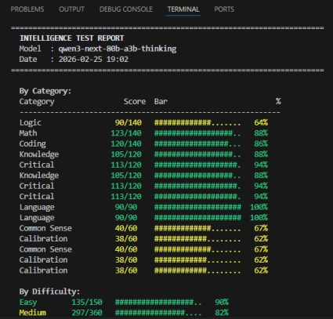

🌐 [English](../README.md) | [Tiếng Việt](README.vi.md)

---

# Bộ Kiểm Tra Trí Tuệ LLM

[](https://www.python.org/downloads/)

Một bộ tiêu chuẩn đánh giá LLM toàn diện, lấy cảm hứng từ các kiểm tra công nghiệp tiêu chuẩn (MMLU, GSM8K, HumanEval, BIG-Bench Hard, TruthfulQA). Được thiết kế để đánh giá các mô hình ngôn ngữ trên nhiều chiều khác nhau: logic, toán học, lập trình, kiến thức, tư duy phản biện, khả năng ngôn ngữ và hiểu biết chung.

**Hỗ trợ song ngữ**: Tiếng Anh + Tiếng Việt

---

## Tính Năng

- **40+ câu hỏi** trên 8 danh mục với 3 mức độ khó (Dễ/Trung bình/Khó)
- **Song ngữ**: Bộ câu hỏi Tiếng Anh và Tiếng Việt
- **Đánh giá đa phương pháp**:
  - Khớp từ khóa (nhanh, xác định)
  - Khớp chính xác/số (toán học, đầu ra code)
  - Thực thi code (chạy Python được tạo, kiểm tra đầu ra)
  - LLM-as-Judge (tùy chọn, sử dụng mô hình thứ hai để chấm)
- **Đánh giá có trọng số theo độ khó** (Dễ=1x, Trung bình=2x, Khó=3x)
- **Báo cáo JSON có cấu trúc** với phân tích theo danh mục và ngôn ngữ
- **Chế độ so sánh**: Chạy nhiều mô hình và so sánh kết quả
- **Không có phụ thuộc bên ngoài** (chỉ dùng Python stdlib)
- **API tương thích OpenAI** (hoạt động với LM Studio, Ollama, OpenAI, Dashscope, v.v.)

---

## Yêu Cầu

- **Python 3.10+** (sử dụng cú pháp hiện đại với type hints `list[...]`)
- Không cần các gói pip

---

## Cài Đặt

```bash
git clone https://github.com/yourusername/llm-benchmark.git
cd llm-benchmark
python main.py --help
```

---

## Bắt Đầu Nhanh

### Chế độ tương tác (hỏi từng câu hỏi)
```bash
python main.py
```

### Chạy tất cả câu hỏi với mô hình cụ thể
```bash
python main.py "your-model-id" --all -s
```

### Chạy tất cả câu hỏi với đầu ra chi tiết
```bash
python main.py "your-model-id" --all -v
```

### Chạy phiên bản nhanh (1 câu hỏi mỗi mức độ khó)
```bash
python main.py "your-model-id" --quick
```

### Kiểm tra chỉ danh mục Toán học
```bash
python main.py "your-model-id" --cat Math
```

### Kiểm tra chỉ câu hỏi Tiếng Việt
```bash
python main.py "your-model-id" --lang vi
```

### Bật đánh giá LLM-as-Judge (sử dụng mô hình thứ hai để đánh giá phản hồi)
```bash
python main.py "your-model-id" --all --judge "judge-model-id"
```

### So sánh hai mô hình
```bash
python main.py --compare "model-a" "model-b" --all
```

---

## Ví Dụ Đầu Ra

Đây là hình ảnh kết quả kiểm tra:



Báo cáo hiển thị:
- **Phân tích điểm** theo danh mục và mức độ khó
- **Thanh tiến độ trực quan** để đánh giá nhanh
- **Điểm có trọng số** với độ chính xác phần trăm
- **Kết quả cụ thể ngôn ngữ** (Tiếng Anh vs Tiếng Việt)

---

## Cấu Hình

Đặt các biến môi trường để tùy chỉnh điểm cuối API và mô hình:

```bash
export OPENAI_BASE_URL="http://localhost:1234/v1"           # Điểm cuối API (mặc định: localhost)
export OPENAI_API_KEY="your-api-key-here"                  # Khóa API (tùy chọn, để trống cho cục bộ)
export OPENAI_MODEL="your-model-id"                        # Mô hình mặc định để sử dụng
export API_TIMEOUT="240"                                   # Giây cho mỗi yêu cầu API (mặc định: 240)
export REPORT_DIR="reports"                                # Thư mục để lưu báo cáo JSON (mặc định: reports)
```

Hoặc ghi đè trên dòng lệnh:
```bash
python main.py --api-key sk-xxx --api-url http://... --timeout 300 "model-id" --all
```

---

## Danh Mục Câu Hỏi

| Danh Mục | Số Lượng | Ví Dụ |
|----------|---------|-------|
| **Logic** | 6 | Câu đố Zebra, câu đố hai người bảo vệ, suy luận |
| **Toán Học** | 6 | Bài toán văn bản kiểu GSM8K, đại số, hình học |
| **Lập Trình** | 5 | Viết/gỡ lỗi Python, giải thích đầu ra, lập trình động |
| **Kiến Thức** | 6 | Khoa học, lịch sử, địa lý (EN + VI) |
| **Tư Duy Phản Biện** | 5 | Phát hiện thiên vị, ước tính Fermi, xác định sai lệch |
| **Ngôn Ngữ** | 5 | Dịch tục ngữ Việt, ngữ pháp, chuyển đổi ngôn ngữ |
| **Hiểu Biết Chung** | 5 | Tiếp tục kiểu HellaSwag, suy luận tình huống |
| **Calibration** | 1 | Không chắc chắn về tính hiểu biết, tự đánh giá độ tin cậy |

---

## Phương Pháp Đánh Giá

Kết quả được tính toán bằng tối đa 4 phương pháp đánh giá (theo thứ tự ưu tiên):

1. **Thực thi Code**: Trích xuất code Python từ phản hồi, chạy trong sandbox (timeout 5s), kiểm tra stdout
2. **Khớp Chính Xác/Số**: Tìm các số cụ thể được mong đợi bất kỳ nơi nào trong phản hồi
3. **Từ Khóa Bắt Buộc (AND)**: Tất cả các từ khóa phải xuất hiện
4. **Từ Khóa Tùy Chọn (OR)**: Ít nhất N trong số M từ khóa phải xuất hiện

Điểm có trọng số = `raw_score × difficulty_weight × base_points` (tối đa 10 điểm mỗi câu hỏi)

Điểm có trọng số tối đa cuối cùng = 450 (45 câu hỏi × 10 điểm, trước khi cân bằng độ khó)

---

## Định Dạng Đầu Ra

Mỗi lần chạy tạo báo cáo JSON trong thư mục `reports/`:

```json
{
  "version": "2.0",
  "model": "your-model-id",
  "timestamp": "2024-01-15T14:30:00Z",
  "summary": {
    "total_weighted_score": 430.5,
    "total_weighted_max": 450.0,
    "percentage": 95.7,
    "questions_asked": 45,
    "avg_latency_s": 8.2
  },
  "by_category": {
    "Logic": {"score": 60.0, "max": 60.0, "pct": 100.0},
    "Math": {"score": 60.0, "max": 60.0, "pct": 100.0},
    ...
  },
  "by_language": {
    "en": {"score": 220.0, "max": 225.0, "pct": 97.8},
    "vi": {"score": 210.5, "max": 225.0, "pct": 93.6}
  }
}
```

---

## Các Nhà Cung Cấp API Được Hỗ Trợ

- **LM Studio** (cục bộ, tương thích OpenAI)
- **Ollama** (cục bộ, tương thích OpenAI)
- **OpenAI** (GPT-4, GPT-3.5, v.v.)
- **Dashscope/Aliyun** (mô hình Qwen)
- **Bất kỳ điểm cuối API nào tương thích OpenAI**

---

## Ví Dụ: Sử Dụng với LM Studio

1. Cài đặt [LM Studio](https://lmstudio.ai) và tải xuống mô hình
2. Bắt đầu máy chủ cục bộ LM Studio (mặc định: `http://localhost:1234/v1`)
3. Chạy:
   ```bash
   python main.py "your-local-model" --all -s
   ```

---

## Khắc Phục Sự Cố

**Kết nối API thất bại?**
- Kiểm tra `OPENAI_BASE_URL` có đúng không
- Đảm bảo máy chủ API đang chạy
- Tăng `API_TIMEOUT` cho kết nối chậm

**Lỗi sandbox thực thi code?**
- Một số mô hình có thể tạo Python không hợp lệ
- Đặt `CODE_TIMEOUT` thành 5+ giây nếu cần

**Điểm độ chính xác thấp?**
- Thử các mô hình nhỏ hơn, chuyên biệt cho các danh mục cụ thể
- Bật chế độ `--judge` cho các câu hỏi mang tính chủ quan

---

## Giấy Phép

MIT

---

## Tham Khảo

Lấy cảm hứng từ:
- **MMLU**: Massive Multitask Language Understanding
- **GSM8K**: Grade School Math 8K
- **HumanEval**: Tiêu chuẩn tạo code
- **BIG-Bench Hard**: Các thách thức cho các mô hình ngôn ngữ lớn
- **TruthfulQA**: Đánh giá ảo ảnh của mô hình ngôn ngữ
- **HellaSwag**: Hiểu biết thường thức thông qua tiếp tục

---

## Đóng Góp

Các vấn đề, đề xuất và yêu cầu pull đều được chào đón!

